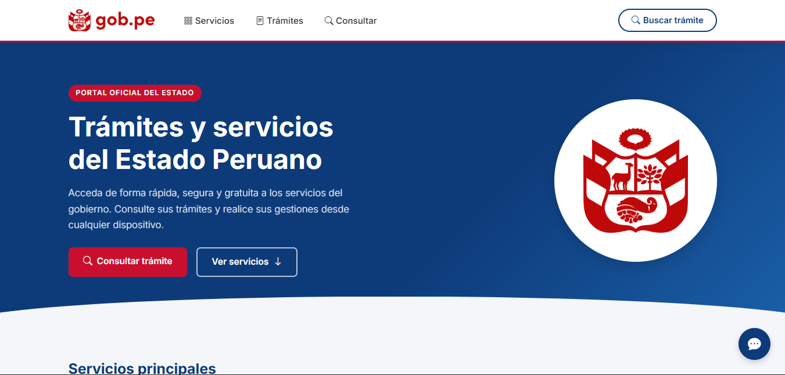

# GOB.PE — Prototipo de Portal Gubernamental



Prototipo funcional de un portal de trámites del Estado Peruano, construido con HTML semántico, Bootstrap 5, CSS personalizado y un backend en Node.js + Express.

## Estructura del proyecto

```
├── public/
│   ├── index.html       # Interfaz principal
│   ├── css/styles.css   # Estilos personalizados
│   └── js/app.js        # Lógica del cliente
├── server.js            # API Express
├── package.json
└── README.md
```

## Requisitos

- [Node.js](https://nodejs.org/) v18 o superior
- npm

## Instalación y ejecución

```bash
npm install
npm start
```

Abra el navegador en: **http://localhost:3000**

## Endpoints del API

| Método | Ruta        | Descripción                                  |
|--------|-------------|----------------------------------------------|
| GET    | `/tramites` | Lista todos los trámites disponibles         |
| POST   | `/consulta` | Busca trámites por nombre, entidad o código  |

### Ejemplo POST `/consulta`

```json
// Request
{ "termino": "DNI" }

// Response
{
  "ok": true,
  "total": 1,
  "data": [{ "id": "T001", "nombre": "Renovación de DNI", ... }]
}
```

## Características

- **Accesibilidad**: skip link, ARIA labels, `aria-live`, navegación por teclado y estructura WCAG 2.1.
- **Responsivo**: navbar colapsable en móvil, grid Bootstrap con `container / row / col`.
- **Formulario validado**: errores claros antes del envío, sin recarga de página.
- **Resultados dinámicos**: renderizado via JavaScript puro con `fetch`.
